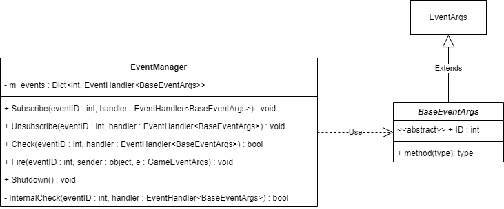

# Event 模块



- [EventManager](./EventManager.md)
- [BaseEventArgs](./BaseEventArgs.md)

## 使用方法
1. 用户定义继承自 BaseEventArgs 用于事件的事件参数
```
public class GameWinArgs : BaseEventArgs
{
    public override int ID => EventID;

    public static int EventID = typeof(GameWinArgs).GetHashCode();

    public GameWinArgs() { }
}
```

2. 事件的响应者订阅该事件
```
GameEntry.Event.Subscribe(GameWinArgs.EventID, WinGame);

private void WinGame(object sender, BaseEventArgs e);
```

3. 事件的触发者触发事件
```
GameEntry.Event.Fire(GameWinArgs.EventID, this, new GameWinArgs());
```

## Q&A
