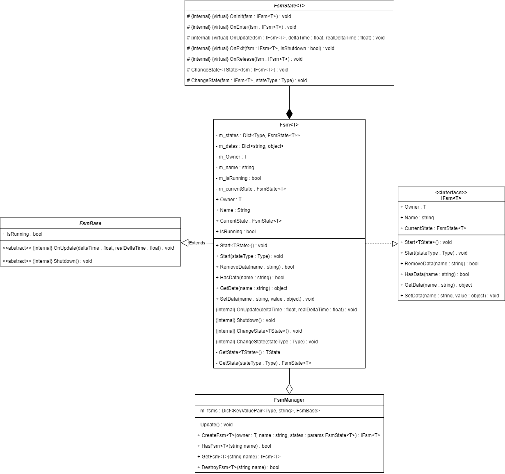

# Fsm 模块

- [FsmManager](./FsmManager.md)
- [IFsm](./IFsm.md)
- [FsmBase](./FsmBase.md)
- [Fsm](./Fsm.md)
- [FsmState](./FsmState.md)

## 使用方法
1. 定义继承自 FsmState\<T\> 的状态类
2. 通过 FsmManager 创建新的状态机
3. 调用状态机的 Start 方法开始运行状态机

## Q&A
> internal 是为了隐藏模块的内部实现