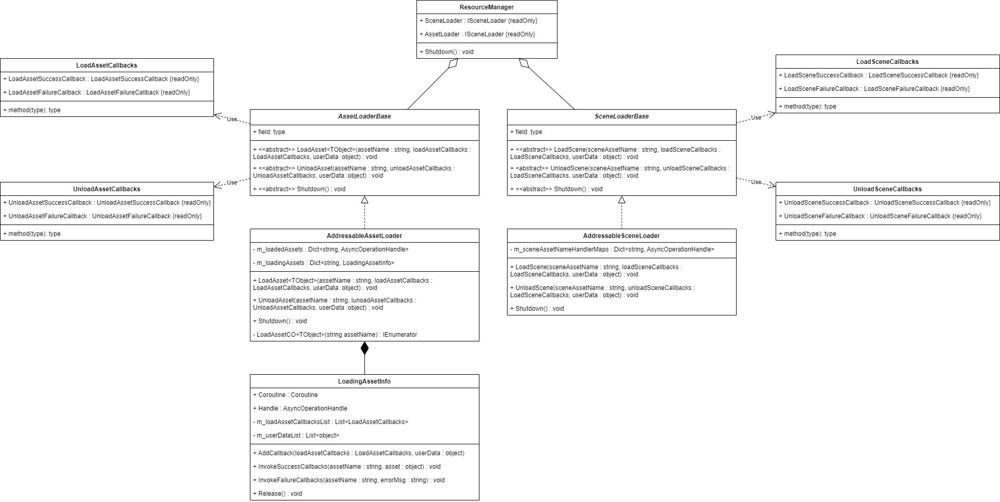

# Resource 模块

- [ResourceManager](./ResourceManager.md)
 

- [SceneLoaderBase](./SceneLoaderBase.md)
- [AddressableSceneLoader](./AddressableSceneLoader.md)
- [LoadSceneCallbacks](./LoadSceneCallbacks.md)
- [UnloadSceneCallbacks](./UnloadSceneCallbacks.md)
 

- [AssetLoaderBase](./AssetLoaderBase.md)
- [AddressableAssetLoader](./AddressableAssetLoader.md)
- [LoadingAssetInfo](./LoadingAssetInfo.md)
- [LoadAssetCallbacks](./LoadAssetCallbacks.md)
- [UnloadAssetCallbacks](./UnloadAssetCallbacks.md)
 

## 使用方法
1. 从 ResourceManager 获取 SceneLoader 或 AssetLoader
2. 定义回调方法
3. 利用 SceneLoader 或 AssetLoader 加载和卸载资源

## Q&A

## 注意事项
**请以 GameObject 类型加载预制体**