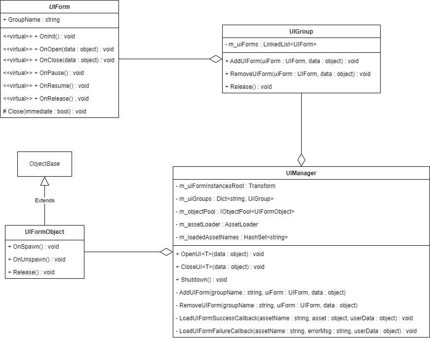

# UI 模块

- [UIManager](./UIManager.md)
- [UIGroup](./UIGroup.md)
- [UIForm](./UIForm.md)
- [UIFormObject](./UIFormObject.md)

## 使用方法
1. 用户定义继承自 UIForm 的类，用于定义 UIForm 的生命周期方法
2. 用户定义继承自 UIFormObject 的类，用于对象池
3. 通过 UIManager 打开和关闭窗体对象

## Q&A
